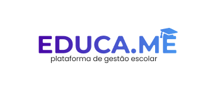

# Educa.me - Projeto Fullstack

    </img>

### A plataforma tem como objetivo principal oferecer um ambiente seguro e intuitivo para as escolas, onde possam ter total controle sobre seus dados administrativos e pedagógicos. Com essa plataforma, é possível gerenciar com eficiência as atividades da instituição de ensino, otimizando processos, melhorando a comunicação e garantindo a segurança das informações.

---

## Repositórios

- [API](https://github.com/EduardoAlvesNeto/educame/api) - Em desenvolvimento
- [Web]() - Em breve
- [Mobile]() - Em breve

---

## Licença

Este projeto está licenciado sob a licença [MIT](https://opensource.org/license/mit/). Consulte o arquivo [LICENSE](LICENSE) para obter mais informações.